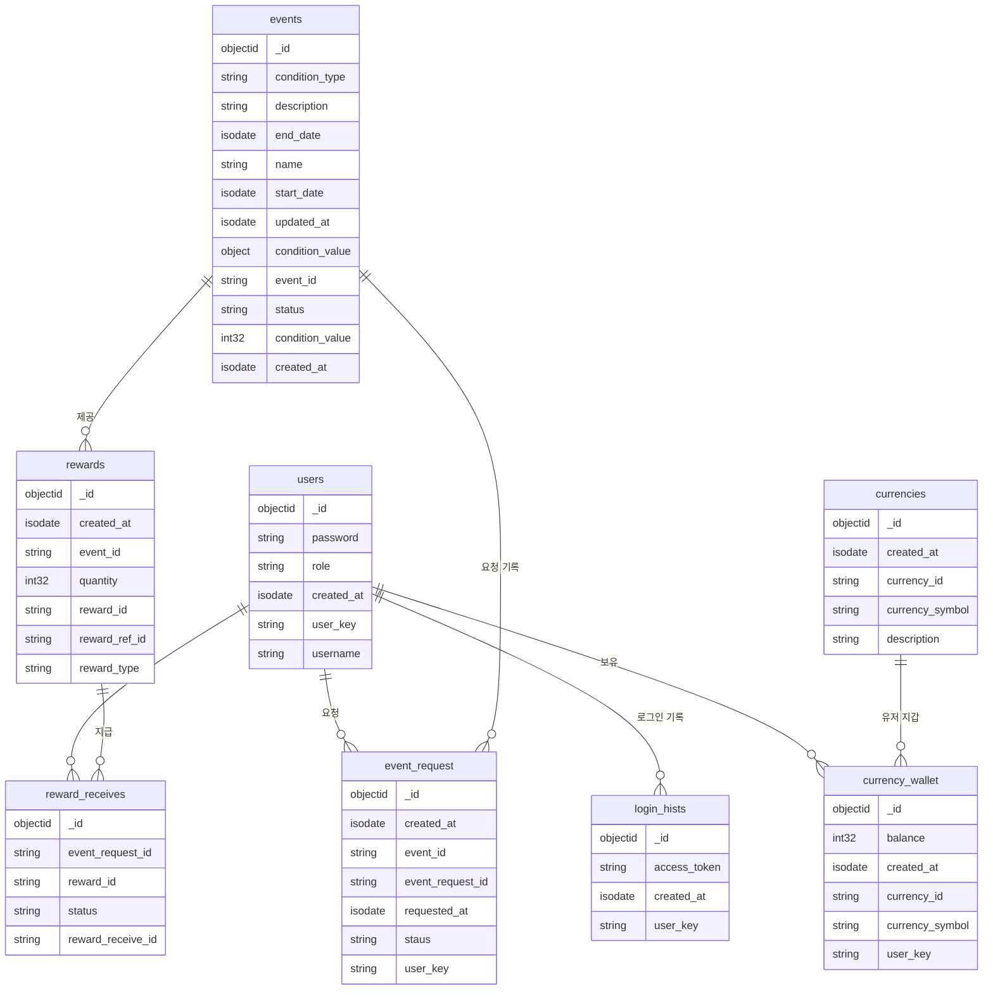

# Compensation-Management-Platform

### 프로젝트 실행 방법
## 시작하기
### 요구사항
- Node.js 18.x 이상
- Docker & Docker Compose
- MongoDB

### 설치 및 실행
1. 저장소 복제
``` bash
git clone https://github.com/your-username/compensation-management-platform.git
cd compensation-management-platform
```
1. Docker로 서비스 실행
``` bash
docker-compose up -d
```
1. 각 서비스 개별 실행 (개발 시)
``` bash
# 인증 서비스
cd auth
npm install
npm run start:dev

# 이벤트 서비스
cd event
npm install
npm run start:dev

# 게이트웨이
cd gateway
npm install
npm run start:dev
```
## API 엔드포인트
API 테스트는 http 디렉토리의 REST API 호출 스크립트를 통해 실행할 수 있습니다:
- 인증 서비스: [http://localhost:3010](http://localhost:3010)
- 이벤트 서비스: [http://localhost:3020](http://localhost:3020)
- 게이트웨이: [http://localhost:3000](http://localhost:3000)

---

## 주요 기능
- **사용자 인증**: 회원가입, 로그인, JWT 기반 인증
- **이벤트 관리**: 이벤트 생성, 관리, 상태 업데이트
- **보상 시스템**: 다양한 보상 설정 및 지급
- **재화 관리**: 사용자별 재화 관리 및 보유 현황

## 프로젝트 구조
``` 
compensation-management-platform/
├── auth/                 # 인증 서비스
├── event/                # 이벤트 관리 서비스
├── gateway/              # API 게이트웨이
├── http/                 # REST API 호출 테스트
├── mongo-init.js         # MongoDB 초기 설정 스크립트
├── Auth.Dockerfile       # 인증 서비스 Docker 설정
├── Event.Dockerfile      # 이벤트 서비스 Docker 설정
├── Gateway.Dockerfile    # 게이트웨이 Docker 설정
└── docker-compose.yml    # 서비스 배포 구성 파일
```


---
### 테이블 설명


## 데이터베이스 모델

| 모델명 | 설명 |
|-------|------|
| users | 회원 정보 관리 |
| login_hist | 사용자 로그인 이력 관리 |
| event | 이벤트 생성 및 관리 |
| reward | 이벤트 보상 정보 관리 |
| event_request | 이벤트 보상 요청 내역 |
| reward_receive | 이벤트 보상 지급 내역 |
| currency | 재화 종류 정의 및 관리 |
| currency_wallet | 사용자별 재화 보유 현황 |


